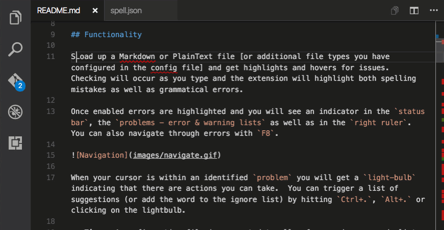

# Spelling and Grammar Checker

>**Notice:** This extension uses the [teacher](http://github.com/vesln/teacher) node module which calls the [After The Deadline](http://afterthedeadline.com) service to check for spelling and grammatical errors.  Document text is sent to the service over **encrypted HTTPS**. That said, I do not recommend using this extension with sensitive or private documents.

[](https://marketplace.visualstudio.com/items?itemName=seanmcbreen.Spell)
[](https://marketplace.visualstudio.com/items?itemName=seanmcbreen.Spell)
[](https://marketplace.visualstudio.com/items?itemName=seanmcbreen.Spell)

## Functionality

Load up a Markdown or PlainText file [or additional file types you have configured in the config file] and get highlights and hovers for issues.  Checking will occur as you type and the extension will highlight spelling mistakes and optionally grammatical errors.  Once enabled you will see an indicator in the `status bar`, the `problems - error & warning lists` as well as in the `right ruler`.  You can also navigate through errors with `F8`.



When your cursor is within an identified `problem` you will get a `light-bulb` indicating that there are actions you can take.  You can trigger a list of suggestions (or add the word to the ignore list) by hitting `Ctrl+.`, `Alt+.` or clicking on the lightbulb.  You will also get a hover notification when you mouse over an issue.

>**Tip:** A configuration file is supported to allow for an: ignore words list, custom mapping between error types and VS Code diagnostic types, additional file types to check, changing from English to other languages and support for ignoring entire blocks of text.  Read on to find out the defaults.

### Changing Indicator Types

The extension is capable of detecting a broad array of problems.  You can choose how these map to VS Code diagnostic types.
* `Disable`: No checking will be provided for this type of problem **this is the default**
* `Error`: A red underline will be rendered - these can get in the way for smoothly running a debug session
* `Warning`: A green underline will be rendered where the error is. 
* `Information`: An information list is available in the status bar (no underlines).
* `Hint`: A hover with the error details will pop-up when you mouse over the error.

This is the settings that are applied unless you override them in your own custom `spell.json` file.
``` json
    "mistakeTypeToStatus": {
        "Spelling": "Error", 
        "Passive voice": "Hint",
        "Complex Expression": "Disable", 
        "Hidden Verbs": "Information", 
        "Hyphen Required": "Disable", 
        "Redundant Expression": "Disable", 
        "Did you mean...": "Disable", 
        "Repeated Word": "Warning", 
        "Missing apostrophe": "Warning", 
        "Cliches": "Disable", 
        "Missing Word": "Disable", 
        "Make I uppercase": "Warning" 
    }
```

### Ignoring Common Blocks

Sometimes you may want to ignore an entire block of text.  This can be useful for avoiding code blocks, links and other common chunks.  To do this there is a section in the config file `ignoreRegExp` where you can put an array of expressions.  These expressions will be matched in the document (in the order of the array) and any matches will not be checked for problems.  The default set of rules are...

``` json
    "ignoreRegExp": [
        "/\\\\(.*\\\\.(jpg|jpeg|png|md|gif|JPG|JPEG|PNG|MD|GIF)\\\\)/g", 
        "/((http|https|ftp|git)\\\\S*)/g"
    ]
```

> **Tip:** The regular expressions are stored in JSON format so the strings must be escaped - typically meaning `\` should be replaced by `\\\\`.  Another common expression for Markdown is ignore code blocks i.e. `/^(\\\\s*)(\\\\w+)?(\\\\s*[\\\\w\\\\W]+?\\\\n*)(\\\\s*)\\\\n*$/gm`.

### Checking Additional File Types

It is possible to configure the extension to work on additional file types by altering a setting. The default settings are:

``` json
    "languageIDs": [
        "markdown",
        "plaintext"
    ]
```

>**Tip:** Other common options include: `todo`, `plaintext`, `latex`.  I don't recommend using this checker for programming files.  There are better options in the marketplace.

## Checking in German, French, Portuguese or Spanish
> kudos to [@alefragnani](https://github.com/alefragnani) for this contribution.

the spell checker can operate in different language modes.  Hit `F1` and type `Spell C...` choose the `spell Checker: Change Language` option from the drop down menu.  You will be presented with a list of available languages.  Select one from the list and the new language will be used for error detection and suggestions.  The default value is English.

``` json
    "language": "en"
```

## Config File Reference

The extension has a rich configuration file to customize the experience.  The file is named `spell.json` should go in the `.vscode` directory.  The easiest way to create it is to add a word to the dictionary, a version of the file with the defaults will be created for you.

>**Tip:** If you make manual updated you need to reload the VS Code window ie. `F1` followed by `Reload Window`.

the config file has the following sections/capabilities:

* `ignoreWordsList` an array of strings that represents words not to check.
* `ignoreRegExp` an array of regular expressions for text to not check.
* `mistakeTypeToStatus` we detect many error types and this is how they map to VS Code Diagnostics.
* `language` change the dictionary to use e.g. French.
* `languageIDs` configure more file types to check

Here is the complete default set of configuration options:
``` json
{
    "language": "en",
    "ignoreWordsList": [],
    "mistakeTypeToStatus": {
        "Spelling": "Error",
        "Passive voice": "Hint",
        "Complex Expression": "Disable",
        "Hidden Verbs": "Information",
        "Hyphen Required": "Disable",
        "Redundant Expression": "Disable",
        "Did you mean...": "Disable",
        "Repeated Word": "Warning",
        "Missing apostrophe": "Warning",
        "Cliches": "Disable",
        "Missing Word": "Disable",
        "Make I uppercase": "Warning"
    },
    "languageIDs": [
        "markdown",
        "plaintext"
    ],
    "ignoreRegExp": [
        "/\\(.*\\.(jpg|jpeg|png|md|gif|JPG|JPEG|PNG|MD|GIF)\\)/g",
        "/((http|https|ftp|git)\\S*)/g"
    ]
}
```


## Update Log

### 0.8.1
Fixed a bug where if no `.vscode` directory existed then changing language, adding to dictionary etc. would fail.  Also added an info message when the new folder is created.

### 0.8.0
This is a big in terms of the UX - suggestions are now code actions so `Ctrl+.` or `Alt+.` both work well to trigger and suggestions are now much more in-line and keyboard friendly.  Additionally you can disable problem types in the configuration and the included settings have been tweeked a little.

### 0.7.0
Improved `README.md` covering off settings for the `spell.json` file better.  If no mapping for an error type is assigned in the config file `Hint` will be used vs `Information` as the default.  Reduced the number of service queries with a delay routine.  Auto activated the extension and checking on first install.

### 0.6.2
**Support for HTTPS** documents are now submitted over the wire for checking using HTTPS.  Increased visibility of web service use [After the Deadline] in the description.  Added badges to `README.md`.

### 0.5.1
**Performance improvement** for activation event.

### 0.5.0 
Added a new set of settings to **ignore chunks of text** that match provided regular expressions.

### 0.4.0 
Added **add to ignore list** in suggest box, added ability to **check additional file types** (`languageIDs`), bug fixes

### 0.3.0 
Added ability to **change language** that is checked (`en`, `de`, `fr`, ...)


