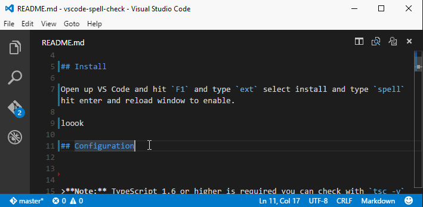

# Functionality

Load up a Markdown file and get highlights and hovers for issues.  Checking will occur as you type and the extension will highlight both spelling mistakes as well as grammatical errors.  

Once enabled and errors are detected you will see them in the status bar Error and Warning lists as well as in the right ruler.  Specific errors will be highlighted with squgglies in the editor itself.

When your cursor is within an error  you can get suggested fixes by hitting `Alt+.`.

You can navigate thorugh errors with `F8` or via the error and wraning counts in the bottom left of the status bar.

A configuration file is supported to allow for an: ignore words list and custom mapping between error types and VS Code diagnostic types.

# Install

Open up VS Code and hit `F1` and type `ext` select install and type `spell` hit enter and reload window to enable. 

# Get a Suggestion

If an error is detected then hit `Alt+.` to get a suggest list and select the suggestion to replace the error.

# Configuration
A [sample file](https://github.com/Microsoft/vscode-spell-check/blob/master/.vscode/spell.json) is included in this repo.  The code has a [set of defaults](https://github.com/Microsoft/vscode-spell-check/blob/master/extension.ts#L109) as well.

the file names `speel.md` should go in the `.vscode` directory. It has the following sections:

* **version** incase I change the format
* **ignoreWordsList** an array of strings that represents words not to check
* **mistakeTypeToStatus** we detect many error types and this is how they map to VS Code severities

For now if you update the config file you need to reload the window for changes to take effect e.g. `F1` and type `reload` then hit enter.

# Backlog

Here are some ideas - fell free to add more...

1. Watch for config file changes to avoid the reload
2. Use VS Code Actions [Lightbulbs] for suggestions e.g. `Ctrl+.`
3. On folder open check every file in the background
	1. Have an `excludeFilesList` in the options
4. Provide an action to add a word to the dictionary 
	1. When adding a word also add plurals/sentence case etc
5. have a delay before checking so calls are less eager
	
# Known Issues

There are a few common errors people hit working with this.

1. Positions can lag a little on updates
2. Suggest does not work on multiple word issues and has a few rough edges