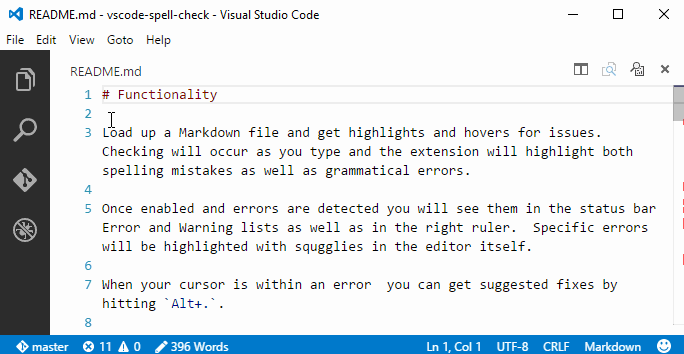

# Spelling and Grammar Checker

>**Notice:** This extension uses the [teacher](http://github.com/vesln/teacher) node module which calls the [After The Deadline](http://afterthedeadline.com) service to check for spelling and grammatical errors.  Document text is sent to the service over encrypted HTTPS. I do not recommend using this extension with sensitive or private documents.


## Functionality

Load up a Markdown file [or additional file types you have configured in the config file] and get highlights and hovers for issues.  Checking will occur as you type and the extension will highlight both spelling mistakes as well as grammatical errors.

Once enabled errors are highlighted and you will see an indicator in the `status bar` Error and Warning lists as well as in the `right ruler`.  You can navigate through errors with `F8` or via the error and warning counts in the bottom left of the status bar.



When your cursor is within an error  you can get suggested fixes (or add the word to the ignore list) by hitting `Alt+.`.

A configuration file is supported to allow for an: ignore words list, custom mapping between error types and VS Code diagnostic types, additional file types to check, changing from English to other languages and support for ignoring entire blocks of text.


## Install

Open up VS Code and hit `F1` and type `ext` select install and type `spell` hit enter and reload window to enable.


## Get a Suggestion

If an error is highlighted you can hit `Alt+.` to get a suggest list.  Choose from the selections and the text will be updated.  Alternatively you can add the highlighted work to the ignore words list/dictionary.

If you get an error message saying the language ID is not supported e.g. `latex` you can add that language ID to the `languageIDs` section of the config file.


## Add to Ignore list/Dictionary

The suggestion list has an option that will let you add words to the dictionary.  Select that item and the `spell.json` config file `ignoreWordsList` array will have the word added to it and the document will be checked again.  

>**Tip:** You can manually edit that file if you wish to remove them.


## Ignoring Common Blocks

Sometimes you may want to ignore an entire block of text.  This can be useful for avoiding code blocks, links and other common chunks.  To do this there is a section of the config file `ignoreRegExp` where you can put an array of expressions.  These expressions will be matched in te document (in the order of the array) and any matches will not be checked for problems.

> **Tip:** The regular expression are stored in JSON format so the strings must be escaped - typically meaning `\` should be replaced by `\\\\`.

Here are a few example strings for Markdown... The first 5 ignore a set of easy to match links, the last one ignores code blocks.

```
    "ignoreRegExp": [
        "/(http\\\\S*)/gm",
        "/\\\\(.*.png\\\\)/g",
        "/\\\\(.*.gif\\\\)/g",
        "/\\\\(.*.md\\\\)/g",
        "/\\\\(.*.jpg\\\\)/g",
        "/^((`{3}\\\\s*)(\\\\w+)?(\\\\s*([\\\\w\\\\W]+?)\\\\n*)\\\\2)\\\\n*(?:[^\\\\S\\\\w\\\\s]|$)/gm"
    ]
```


## Change the language for checking

> kudos to [@alefragnani](https://github.com/alefragnani) for this contribution.

Hit `F1` and type `Spell C...` choose the `Change Language` option from the drop down menu.  You will be presented with a list of available languages.  Select one from the list and the new language will be used for error detection and suggestions.  

Under the covers the language for checking is stored in the config fil in the `language` field.


## Configuration File

A [sample file](https://github.com/Microsoft/vscode-spell-check/blob/master/.vscode/spell.json) is included in this repo.  The code has a [set of defaults](https://github.com/Microsoft/vscode-spell-check/blob/master/extension.ts#L109) as well.

A file named `spell.json` should go in the `.vscode` directory. It has the following sections:

* **version** incase I change the format
* **ignoreWordsList** an array of strings that represents words not to check
* **ignoreRegExp** an array of regular expressions.  This array is empty by default.
* **mistakeTypeToStatus** we detect many error types and this is how they map to VS Code severities
* **language** support for five languages (this can be changed also through `F1` an type `Spell: Choose Language`)
  * `en` = English, [default]
  * `fr` = French,
  * `de` = German,
  * `pt` = Portuguese,
  * `es` = Spanish
* **languageIDs** configure more file types to check e.g. `plaintext` or `latex` (`markdown` is the default)


>**Tip:** You can find the language ID for a file easily by triggering a suggest `Alt+.` in a file that is not in the list.  The error message will include the language ID you should add to the config file.

For now if you update the config file you need to reload the window for changes to take effect e.g. `F1` and type `reload` then hit enter.


## Backlog

Here are some ideas - fell free to add more...

1. Watch for config file changes to avoid the reload
2. Use VS Code Actions [Lightbulbs] for suggestions e.g. `Ctrl+.`
3. On folder open check every file in the background
	1. Have an `excludeFilesList` in the options
4. When adding a word also add plurals/sentence case etc


## Known Issues

There are a few common errors people hit working with this.

1. Positions can lag a little on updates
2. Suggest does not work on multiple word issues and has a few rough edges


## Update Log

### 0.6.0
**Support for HTTPS** documents are now submitted over the wire for checking using HTTPS.

### 0.5.1
**Performance improvement** for activation event.

### 0.5.0 
Added a new set of settings to **ignore chunks of text** that match provided regular expressions.

### 0.4.0 
Added **add to ignore list** in suggest box, added ability to **check additional file types** (`languageIDs`), bug fixes

### 0.3.0 
Added ability to **change language** that is checked (`en`, `de`, `fr`, ...)


