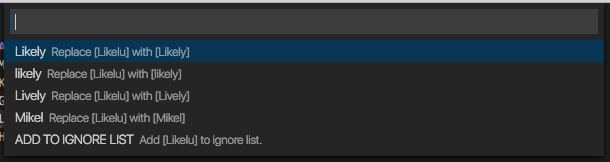
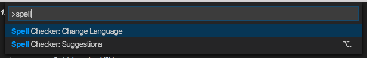

# Spelling and Grammar Checker

>**Notice:** This extension uses the [teacher](http://github.com/vesln/teacher) node module which calls the [After The Deadline](http://afterthedeadline.com) service to check for spelling and grammatical errors.  Document text is sent to the service over encrypted HTTPS. I do not recommend using this extension with sensitive or private documents.

[](https://marketplace.visualstudio.com/items?itemName=seanmcbreen.Spell)
[](https://marketplace.visualstudio.com/items?itemName=seanmcbreen.Spell)
[ ](https://marketplace.visualstudio.com/items?itemName=seanmcbreen.Spell)


## Functionality

Load up a Markdown file [or additional file types you have configured in the config file] and get highlights and hovers for issues.  Checking will occur as you type and the extension will highlight both spelling mistakes as well as grammatical errors.

Once enabled errors are highlighted and you will see an indicator in the `status bar` Error and Warning lists as well as in the `right ruler`.  You can navigate through errors with `F8` or via the error and warning counts in the bottom left of the status bar.


When your cursor is within an error  you can get suggested fixes (or add the word to the ignore list) by hitting `Alt+.`.

>**Tip:** A configuration file is supported to allow for an: ignore words list, custom mapping between error types and VS Code diagnostic types, additional file types to check, changing from English to other languages and support for ignoring entire blocks of text.


## Installing the Extension

Open up VS Code and hit `F1` and type `ext` select install and type `spell` hit enter and reload window to enable.


## Get a Suggestion

If an error is highlighted you can hit `Alt+.` to get a suggest list.  Choose from the selections and the text will be updated.  Alternatively you can add the highlighted work to the ignore words list/dictionary.



>**Tip:** If you get an error message saying the language ID is not supported e.g. `latex` you can add that language ID to the `languageIDs` section of the config file.


## Change the Language for Checking

Hit `F1` and type `Spell C...` choose the `Change Language` option from the drop down menu.  You will be presented with a list of available languages.  Select one from the list and the new language will be used for error detection and suggestions.  

Under the covers the language for checking is stored in the config fil in the `language` field.
 


> kudos to [@alefragnani](https://github.com/alefragnani) for this contribution.


## Config File

The extension has a rich configuration file to customize the experience.  The file is named `spell.json` should go in the `.vscode` directory. 

>**Tip:** If you make manual updated you need to reload the VS Code window ie. `F1` followed by `Reload Window`.

It has the following sections/capabilities:

* `ignoreWordsList` an array of strings that represents words not to check (this can be added to via the `Alt+.` suggest fix menu).
* `ignoreRegExp` an array of regular expressions for text to not check.  This array is empty by default.
* `mistakeTypeToStatus` we detect many error types and this is how they map to VS Code severities.
* `language` support for five languages (this can be changed also through `F1` and type `Spell: Choose Language`)
* `languageIDs` configure more file types to check e.g. `plaintext` or `latex` (`markdown` is the default)

More details on each setting are provided below.  A [sample file](https://github.com/Microsoft/vscode-spell-check/blob/master/.vscode/spell.json) is included in this repo.  The extension has a [set of defaults](https://github.com/Microsoft/vscode-spell-check/blob/master/extension.ts#L146) as well.


### Add to Ignore List/Dictionary

The suggestion list provides an option to add words to the dictionary.  Select that item and the `spell.json` config file `ignoreWordsList` array will have the word added to it and the document will be checked again.  

``` json
    "ignoreWordsList": [
        "vscode",
        "Markdown"
    ]
```

>**Tip:** You can manually edit that file if you wish to remove words.

### Ignoring Common Blocks

Sometimes you may want to ignore an entire block of text.  This can be useful for avoiding code blocks, links and other common chunks.  To do this there is a section in the config file `ignoreRegExp` where you can put an array of expressions.  These expressions will be matched in te document (in the order of the array) and any matches will not be checked for problems.

Here are a few example strings for Markdown... The first 5 ignore a set of easy to match links, the last one ignores code blocks.

``` json
    "ignoreRegExp": [
        "/(http\\\\S*)/gm",
        "/\\\\(.*.png\\\\)/g",
        "/\\\\(.*.gif\\\\)/g",
        "/\\\\(.*.md\\\\)/g",
        "/\\\\(.*.jpg\\\\)/g",
        "/^((`{3}\\\\s*)(\\\\w+)?(\\\\s*([\\\\w\\\\W]+?)\\\\n*)\\\\2)\\\\n*(?:[^\\\\S\\\\w\\\\s]|$)/gm"
    ]
```

> **Tip:** The regular expression are stored in JSON format so the strings must be escaped - typically meaning `\` should be replaced by `\\\\`.


### Changing Indicator Types

The extension is capable of a broad array of checks.  You can choose how these map to VS Code diagnostic types.
* `Error`: A red underline will be rendered - these can get in the way for smoothly running a debug session
* `Warning`: A green underline will be rendered where the error is. 
* `Information`: An information list is available in the status bar (no underlines).
* `Hint`: A hover with the error details will pop-up when you mouse over the error.

``` json
    "mistakeTypeToStatus": {
        "Passive voice": "Hint",
        "Spelling": "Error",
        "Complex Expression": "Warning",
        "Hidden Verbs": "Information",
        "Hyphen Required": "Warning",
        "Redundant Expression": "Information",
        "Did you mean...": "Information",
        "Repeated Word": "Warning",
        "Missing apostrophe": "Warning",
        "Cliches": "Warning",
        "Missing Word": "Warning",
        "Make I uppercase": "Warning"
    }
```

>**Tip:** Any missing indicator type from the list above will default to a `Hint`. 

### Changing the Language For Checking

The following values can be added in the config file to set the language that should be used for checking. 

  * `en` = English, [default]
  * `fr` = French,
  * `de` = German,
  * `pt` = Portuguese,
  * `es` = Spanish

``` json
    "language": "en"
```


### Checking Additional File Types

It is possible to configure the extension to work on additional file types by altering a setting.

``` json
    "languageIDs": [
        "markdown",
        "latex",
        "plaintext",
        "todo"
    ]
```

>**Tip:** You can find the language ID for a file easily by triggering a suggest `Alt+.` in a file that is not in the list.  The error message will include the language ID you should add to the config file.


## Backlog

Here are some ideas - fell free to add more...

1. Watch for config file changes to avoid the reload
2. Use VS Code Actions [Lightbulbs] for suggestions e.g. `Ctrl+.`
3. On folder open check every file in the background
	1. Have an `excludeFilesList` in the options
4. When adding a word also add plurals/sentence case etc


## Known Issues

There are a few common errors people hit working with this.

1. Positions can lag a little on updates
2. Suggest does not work on multiple word issues and has a few rough edges


## Update Log

### 0.7.0
Improved `README.md` covering off settings for the `spell.json` file better.  If no mapping for an error type is assigned in the config file `Hint` will be used vs `Information` as the default.  Reduced the number of service queries with a delay routine.  Auto activated the extension and checking on first install.

### 0.6.2
**Support for HTTPS** documents are now submitted over the wire for checking using HTTPS.  Increased visibility of web service use [After the Deadline] in the description.  Added badges to `README.md`.

### 0.5.1
**Performance improvement** for activation event.

### 0.5.0 
Added a new set of settings to **ignore chunks of text** that match provided regular expressions.

### 0.4.0 
Added **add to ignore list** in suggest box, added ability to **check additional file types** (`languageIDs`), bug fixes

### 0.3.0 
Added ability to **change language** that is checked (`en`, `de`, `fr`, ...)


