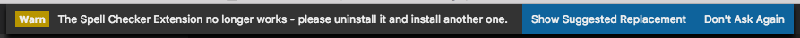

# [DEPRECATED] Spelling and Grammar Checker

Unfortunately, the underlying service that this extension depends upon has stopped working.  This impacts English 100% of the time, the extension continues to work intermittently for other languages.  

## Better Spell Checkers are Available - Time to Upgrade

**I recommend you [un-install this extension](https://code.visualstudio.com/docs/editor/extension-gallery#_manage-extensions)** and use one of the other options such as [Code Spellchecker](https://marketplace.visualstudio.com/items?itemName=streetsidesoftware.code-spell-checker) in it's place.  I'm publishing this update to help users find a valid migration path. 

To highlight this to existing users upon activating the extension you will see a new warning message:  

## I want to keep using the extension - Stop Nagging Me

If you choose to continue to use the extension, click `Don't Ask Again` in the warning message.  Which will create a setting in your VS Code User Settings to suppress the message from coming up again.  Delete that setting `"spell.StopAsking": true` when you do finally uninstall the extension.

I do intend to un-publish the extension in the next month so to prevent new users from finding it when searching for a spell checker.  

When this happens any local copy you have will continue to work.  There will also be a .VSIX file in the [extension repository](https://marketplace.visualstudio.com/items?itemName=seanmcbreen.Spell) should you want to get it and [load it into VS Code](https://code.visualstudio.com/docs/editor/extension-gallery#_install-from-a-vsix).

## Additional README Content / User Guide
If you are still using the extension and wish to review the full user guide [click here](LEGACYREADME.md).

# Change Log

A [complete CHANGELOG](CHANGELOG.md) is maintained here.

## 1.0.0 
Added guidance to un-install extension based on instability of the underlying service with a suggestion to leverage another one of the options out there.
